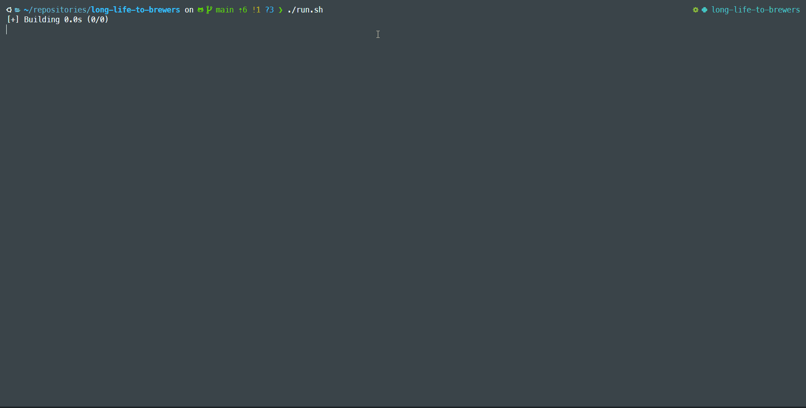

# Long Life to Brewers 🍺

This repository was created as a personal project and as a proposal for the Breweries Case.

## Required Tools

- **Python**: Version 3.10.* or compatible;
- **PIP**: Version 22.0.2 or compatible;
- **Docker Compose**: Version v2.29.6 or compatible;
- **Docker**: Version 28.0.4 or compatible.

## Recommended Tools

- **PDM**: Version 2.22.4 or compatible. PDM is recommended for development purposes. For running or installing packages, you can use PIP.

## Project Structure

This project consists of several services and is structured to allow these components to be easily executed. It is important to note that this structure is not intended to represent a production-grade architecture but rather a setup for development, learning, and testing purposes.

### Services Included

- **Airflow**: Task orchestration service;
- **MinIO**: File storage service;
- **PostgreSQL**: Relational database for storing services data and metadata;
- **Redis**: In-memory database for caching and fast data access;
- **Spark, Iceberg, and Notebooks**: Data processing services;
- **Rest Data Catalog**: Data catalog service for managing and discovering datasets;
- **Marquez**: Metadata service for tracking data lineage and job execution;
- **Brewery**: The main package of the project, responsible for data extraction, transformation, and loading (ETL) processes.

### Service Ports

After starting the services, they will be available at the following ports:

- **Airflow Web Server**: <http://localhost:8000>
- **MinIO Console**: <http://localhost:9001>
- **Spark JupyterLab**: <http://localhost:8888>
- **Marquez Web**: <http://localhost:3000>

## Running the Project

The first step to running the project is to have it available in your local environment. To do this, you can clone the repository or download the project as a zip file.

```bash
git clone https://github.com/joaoguilhermeall/long-life-to-brewers.git

cd long-life-to-brewers
```

Once in the project folder, there are two scripts designed to simplify the usage of the project. To prepare the environment with exported environment variables, simply run the `setup.sh` script. To run the project locally without an orchestrator, execute the `run.sh` script.

### Scripts

- **`setup.sh`**: This script sets up the environment variables and prepares the project for execution and services to start. It is recommended to run this script before executing any other commands.
- **`run.sh`**: This script runs the project locally without an orchestrator. It is recommended to run this script after executing `setup.sh`.

If this is the first time running the `setup.sh` script, it will prompt you to provide a secret to configure all services. This secret must remain consistent; otherwise, you will need to delete the Docker volumes and restart the services. The first time it is requested, it will be saved in the `.breweries_secret` file.

Alternatively, instead of running the `setup.sh` script, you can manually export the required environment variables for the project to function. After that, execute `docker compose up -d` to start the services.

Another way to run the project is by starting the services and manually triggering the DAG in the Airflow interface. To do this, execute the `docker compose up -d` command and then access the Airflow interface at `http://localhost:8080` to trigger the DAG manually.

## About the Implementation

The project consists of configuring the environment and developing the `brewery` package.

### Package Responsibilities

- **Bronze**: Implements a Storage Client and an Open Brewery Client. The Storage Client is responsible for uploading data to MinIO, and the Open Brewery Client is responsible for extracting data from the Open Brewery DB API. The extraction is optimized for efficiency by customizing the number of requests and parallel executors. Each executor creates a file with the extracted data. The Storage Client uploads the data to MinIO, while the Open Brewery Client handles the API extraction.
- **Silver**: Opens a Spark session to read and transform the data. The transformation involves schema validation and writing the data in Parquet format using the Iceberg specification. In the Silver layer, the data is structured and stored in tables managed by the Rest Catalog, with the data written to MinIO. The Rest Catalog handles metadata storage and data discovery.
- **Gold**: Also starts a Spark session, but it reads directly from the Silver tables and performs aggregations for reporting. The data is stored in MinIO in Parquet format using the Iceberg specification. The Rest Catalog handles metadata storage and data discovery.
- **Pipeline**: Orchestrates the execution of the other stages.

To simplify execution, an initialization script is generated when the library is installed. To execute, simply call the `brewery-cli --help` command to see the available options.

### Error Handling and Logging

Each process includes error handlers to enable asynchronous execution and allow re-execution in case of errors. Additionally, the project has a logging system to record relevant information during execution.

### Monitoring and Data Tracking

The project includes a monitoring and data tracking system. Marquez is used to track executions, allowing you to view job execution history, data lineage, and identify where errors occurred through the Marquez interface.

## Development

If you want to contribute or implement new features, the project already has a development environment configured. To set it up, simply run the `pdm install` command to install the project dependencies. The project uses a virtual environment, and the dependencies are listed in the `pyproject.toml` file.

```bash
# Install Dependencies
pdm install
```

## Testing

The project includes unit tests to ensure the functionality of the implemented features. The tests are located in the `tests` folder and can be run using the `pytest` command.

```bash
# Run Tests
pytest

# Run Tests with Verbose Output
pytest -vvv
```

## Execution Showcase

<p align="center" width="70%">
    
</p>

## References

- [Airflow](https://airflow.apache.org/)
- [MinIO](https://min.io/)
- [PostgreSQL](https://www.postgresql.org/)
- [Redis](https://redis.io/)
- [Spark](https://spark.apache.org/)
- [Iceberg](https://iceberg.apache.org/)
- [Marquez](https://github.com/MarquezProject/marquez)
- [PDM](https://pdm-project.org/en/latest/)
